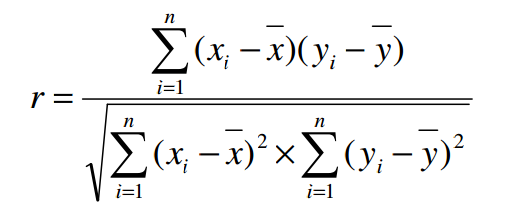

```{r setup, include=FALSE}
library(dplyr)
library(caret)
library(lars)
library(gmodels)
library(ggplot2)
library(elasticnet)
library(gridExtra)
library(corrplot)

data <- read.table('E:/UFCG2/AD2/pesquisas/prostate- atividade3/prostate.dat')
data_training <- filter(data, train == TRUE)
data_test <- filter(data, train == FALSE)

graph_vol <- qplot(data$lcavol, data$lpsa, xlab="Volume", ylab="psa ng/ml")
graph_weight <- qplot(data$lweight, data$lpsa, xlab="Peso", ylab="psa ng/ml")
graph_age <- qplot(data$age, data$lpsa, xlab="Idade", ylab="psa ng/ml")
graph_bph <- qplot(data$lbph, data$lpsa, xlab="Hiperplasia prostática benigna", ylab="psa ng/ml")
graph_svi <- qplot(data$svi, data$lpsa, xlab="Invasão das vesículas seminais", ylab="psa ng/ml")
graph_lcp <- qplot(data$lcp, data$lpsa, xlab="Penetração capsular", ylab="psa ng/ml")
graph_gleason <- qplot(data$gleason, data$lpsa, xlab="Escore Gleason", ylab="psa ng/ml")
graph_pgg45 <- qplot(data$pgg45, data$lpsa, xlab="Porcentagem escore Gleason (4 ou 5)", ylab="psa ng/ml")

```

##Introdução

  Os níveis de psa no sangue indicam que o indivíduo está com câncer de   próstata para valores acima de 4ng/ml. Existem vários fatores que podem estar ligados aos níveis de psa no sangue e alguma forma como por exemplo o volume do câncer. A pergunta báse de nossa pesquisa é 
    "A partir de algum fator, é possível prever os níveis de psa no sangue do indivíduo?". 

  Escolhemos alguns dados de exames de pacientes do sexo masculino afim de   identificar câncer de próstata[(veja aqui)](http://statweb.stanford.edu/~tibs/ElemStatLearn/datasets/prostate.data). Para cada valor em alguns fatores aplicamos O logaritmo para que os dados fossem melhor ajustados.

  O sumário dos dados pode ser visto abaixo:

    #vol: volume do câncer
    #weight:  peso do paciente
    #age: idade do paciente
    #bph: hiperplasia prostática benigna
    #svi: invasão das vesículas seminais
    #cp: penetração capsular
    #gleason: escore Gleason
    #pgg45: percentagem escore Gleason 4 ou 5
    #psa: antígeno específico da próstata (esta é a variável resposta).
  
  Nosso objetivo nessa pesquisa é encontrar um modelo linear para prever os valores de níveis de psa( em inglês Prostate Specific Antigen) no sangue que é um dos indicadores do câncer de próstata [(veja  aqui)](http://www.oncoguia.org.br/conteudo/antigeno-prostatico-especifico-psa-no-diagnostico-do-cancer-de-prostata/1202/289/). 
  
  A princípio, vamos calcular para cada par de variáveis (X, psa) o coeficiente de correlação de pearson e verificar o quanto cada fator influencia nos níveis de PSA. Como o fator que queremos analisar é o PSA teremos que o Y no par será sempre o PSA enquanto que X será qualquer um dos outros fatores. 
  
##Coeficientes e Gráficos de correlação(R)
  
  Nossa primeira meta é descobrir, através do coeficiente e dos  gráficos de de correlação descobrir quais variáveis apresentam indícios de relação com os níveis de psa e então posteriormente trabalharmos encima delas para gerar um modelo de regressão validá-lo e regerar o modelo utilizando técnicas do método LASSO.





  Quando o coeficiente de Pearson resulta em um valor próximo de -1 ou 1 temos relação forte entre os fatores. Quando ele está próximo de 0, há indícios de que os fatores não tem relação nenhuma. Se r resulta em um valor próximo de -1 há indícios de que há uma relação inversa entre as variáveis, isto é, são inversamente proporcionais. Se r resulta em um valor próximo de 1 dizemos que a relação é diretamente proporcional e quando os valores de uma cresce a outra cresce aproximadamente igual.
  
  Abaixo mostramos um quadro com todos os valores r de cada par de fatores dos nossos dados
```{r}
cex.before <- par("cex")
par(cex = 0.7)
corrplot(cor(data), insig = "blank", method = "color",
         addCoef.col="grey", 
         order = "AOE", tl.cex = 1/par("cex"),
         cl.cex = 1/par("cex"), addCoefasPercent = TRUE)
par(cex = cex.before)
```

  Após calcularmos os coeficientes de correlação, vamos visualizar melhor a relação entre as variáveis e o psa

```{r}
grid.arrange(graph_vol, graph_weight, graph_age, graph_bph, ncol=2, nrow=2)
```


```{r}
grid.arrange(graph_svi, graph_lcp, graph_gleason, graph_pgg45, ncol=2, nrow=2)
```


  Aparentemente os 4 primeiros gráficos são os que apresentam indícios de relação entre as variáveis. Os outros apresentam dados dispersos e sem nenhum "padrão". O fator que mais parece ter relação com o psa é o volume do câncer, quanto maior o volume do cancer mais psa no sangue o indivíduo apresenta.


##Construindo o modelo de regressão

  O modelo de regressão foi construído baseado nos fatores que mais apresentaram ter influência no psa segundo os gráficos apresentados anteriormente e os coeficientes de correlação de cada par de fatores (X, psa). Os fatores relevantes, foram aqueles cujos seus coeficientes de correlação foram superior a 50%. Os fatores escolhidos foram o volume(lcavol), a invasão das vesículas seminais(svi) e a penetração capsular(cp).
  Com isso montamos o nosso modelo de regressão linear múltipla, com os fatores escolhidos 

```{r}
regression_line <- lm(lpsa ~ lcavol+svi+lcp, data = data_training)
predictions <- predict(regression_line, select(data_test,lcavol, svi, lcp))
lm_predictions <- data.frame(pred = predictions, obs = data_test$lpsa)

ggplot(lm_predictions, aes(x = pred, y = obs)) + geom_point(alpha = 0.5, position = position_jitter(width=0.2)) + geom_abline(colour = "blue") + ggtitle("Predição vs psa")
```


##Avaliação do modelo

  Para avaliarmos o modelo, fizemos um gráfico comparativo entre os resíduos e os valores das predições

```{r}
trash <- data_test$lpsa - predictions
qplot(predictions, trash, ylab = "Resíduos", xlab = "Predições") + geom_hline(yintercept = 0, color='blue') + ggtitle("Predições x Resíduos")
```
e calculamos o valor do RMSE(Raiz do erro quadrático da média)

```{r}
RMSE(predictions, data_test$lpsa)
```

Indicando um valor um pouco alto para os resíduos

##Criando um modelo usando a técnica LASSO

Vamos observar o modelo gerado com a técnica LASSO. Essa técnica é importante para verificarmos quais fatores mais influenciam nos resultadose ajustar um modelo ao formato "exato" dos dados. 

Geramos um modelo usando essa técnica a partir do conjunto de dados de treino e usando o RMSE como métrica. O gráfico abaixo mostra a curva do modelo ajustado.

```{r}
lasso <- train(lpsa ~ ., data=select(data_training, lcavol, lweight, age, lbph, svi, lcp, gleason, pgg45, lpsa), method='lasso', metric='RMSE',tuneLength=10)
```

Calculando a importância dos fatores usando a técnica vemos que a o fator volume(lcavol) é o que mais influência no resultado.

```{r}
plot(lasso)
```

E calculamos os valores preditores. Observe que agora precisamos encontrar o modelo usando todos os fatores, pois queremos saber qual a mais influente.

```{r}
plot(varImp(lasso), xlab = "Importância")
```

E comparamos com os valores observados

```{r}
lasso_predictions <- predict(lasso, select(data_test,lcavol, lweight, age, lbph, svi, lcp, gleason, pgg45))

la_predictions <- data.frame(pred = lasso_predictions, obs = data_test$lpsa)
ggplot(la_predictions, aes(x = pred, y = obs)) + geom_point(alpha = 0.5, position = position_jitter(width=0.2)) + geom_abline(colour = "blue") + ggtitle("Observados vs Previstos (LASSO)")
```

O RMSE do modelo usando LASSO é igual a

```{r}
RMSE(lasso_predictions, data_test$lpsa)
```

E por fim podemos comparar os dois modelos

```{r}
compare <- lm_predictions
lm_predictions$model <- "RL"
la_predictions$model <- "LASSO"
compare <- rbind(lm_predictions, la_predictions)
ggplot(compare, aes(x = pred, y = obs)) + 
  geom_point(alpha = 0.5, position = position_jitter(width=0.2)) + 
  facet_grid(. ~ model) + 
  geom_abline() +
  ggtitle(" Modelo de Regressão múltipla e modelo usando a técnica LASSO(Comparação)")
```

##Conclusão
Depois dos dados analisados e dos gráficos mostrados, podemos inferir que há indícios de que o câncer de próstata está ligado ao volume do câncer. O modelo apresentou um valor alto para o RMSE tanto na regressão múltipla quanto usando a técnica LASSO, o que indica que é um modelo não confiável. Não houve uma melhoria usando a técnica, os resultados obtidos através do modelo LASSO não foram precisos(o que é característica do modelo LASSO na maioria das vezes), o RMSE calculado para a a mostra foi alto. Outros fatores influenciaram o modelo de regressão, porém o volume do câncer apresentou uma maior correlação com os níveis de psa durante toda a análise dos dados. Portanto, se há uma variável que poderia explicar, os níveis de psa no sangue de um indíviduo é o volume do câncer, quanto maior, maior quantidade de psa o indivíduo terá no sangue.


##Bibliografia

[Wikipedia: ](https://pt.wikipedia.org/wiki/Sobreajuste)

[RStudio.com:](https://www.rstudio.com/wp-content/uploads/2015/03/ggplot2-cheatsheet.pdf)

[R documentação](https://www.r-project.org/)

[Sobre o significado do psa :]( http://www.oncoguia.org.br/conteudo/antigeno-prostatico-especifico-psa-no-diagnostico-do-cancer-de-prostata/1202/289/)

link para o projeto completo no github : 